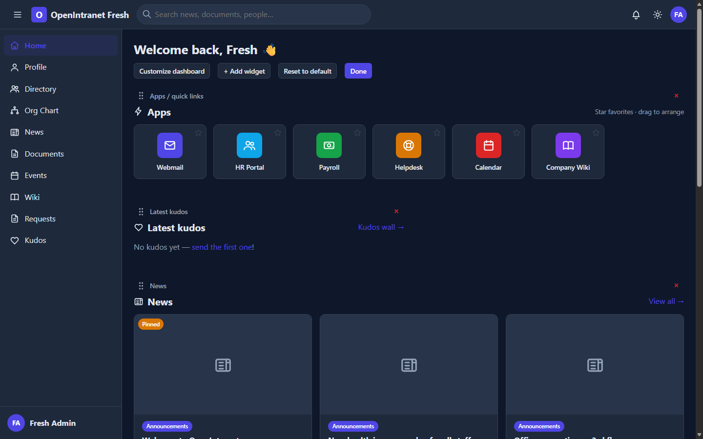
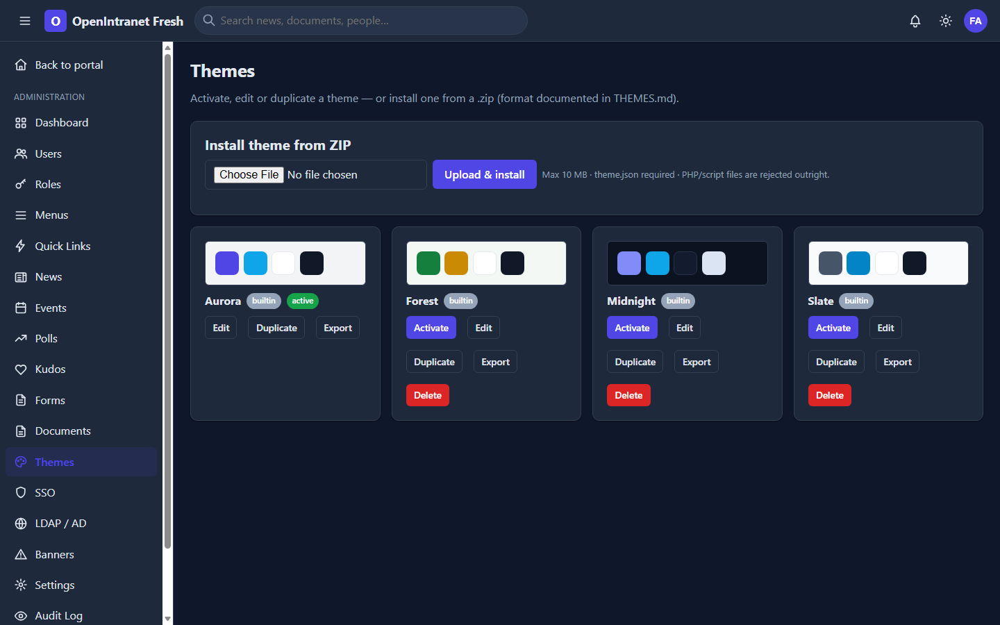

# OpenIntranet

An open-source company intranet portal in **pure vanilla PHP** — no
frameworks, no Composer, no build tools. Everything is hand-rolled on PHP's
standard library (PDO, sodium, curl, DOMDocument, finfo, GD, ZipArchive).

 <!-- screenshot placeholder -->
 <!-- screenshot placeholder -->

## Features

- **App launcher** — quick-link tiles with favorites, personal ordering and
  click analytics (sparklines), SVG-sanitized custom icons
- **News** — custom WYSIWYG editor, scheduling (`publish:due` cron), pinning,
  comments + emoji reactions, signed employee-preview links, server-side HTML
  sanitizer
- **Documents & gazette** — permission-checked `/files/{uuid}` delivery,
  MIME-verified uploads, versioning with restore, nested categories, bulk ops
- **Employee directory** — search-as-you-type, filters + A–Z bar, skills,
  vCards, per-field visibility settings
- **Org chart** — interactive SVG tree (pan/zoom/collapse/search), PNG
  export, cycle detection with an admin data-quality report
- **Users & RBAC** — roles/permissions matrix, CSV import with dry-run,
  impersonation with audit trail, invite e-mails
- **SSO** — Google, Microsoft Entra ID and any OIDC provider; hand-rolled
  Authorization Code + PKCE client with full RS256 ID-token validation
- **Theme engine** — design tokens, 4 built-in themes, visual editor with
  live preview + WCAG checks, dark mode, ZIP theme install with hard security
  guards
- **Admin panel** — dashboard with canvas charts, tabbed settings, module
  toggles, maintenance mode, audit log with CSV export
- **Hardened** — CSP self-only scripts, rate limiting, SSRF/IDOR/open-redirect
  guards, storage quotas, encrypted secrets at rest, `routes:audit` command

## Quick start — Docker

```bash
git clone https://github.com/your-org/openintranet && cd openintranet
make up            # builds and starts app + MariaDB + Mailpit
# open http://localhost:8080/install and follow the 5-step wizard
#   DB host: db · database: openintranet · user: intranet · password: intranet
make demo          # optional: ~30 demo users, news, documents
```

## Quick start — classic LAMP

1. Requirements: PHP **8.2+** with `pdo_mysql curl openssl sodium gd zip fileinfo`,
   MySQL/MariaDB, Apache (mod_rewrite) or nginx.
2. Point the **document root at `public/`** (see `docs/nginx.conf.example`;
   Apache works out of the box via the bundled `.htaccess` files).
3. Make `storage/`, `themes/uploaded/` and `public/assets/` writable by the
   web server.
4. Open `https://your-host/install` and follow the wizard — it checks
   requirements, writes `.env`, migrates, seeds and creates your admin.
5. Set up cron: see `docs/CRON.md`.

## Quick start — shared hosting

Upload everything into your webspace (e.g. `public_html/intranet/`). The root
`.htaccess` routes requests into `public/` and denies access to application
internals. Then open `/intranet/install`.

## CLI

```
php cli.php migrate | seed | seed:demo | make:admin email pass | backup
php cli.php publish:due | audit:prune | routes:audit | svg:test | key:generate
```

## Docs

- [THEMES.md](THEMES.md) — custom theme ZIP format
- [SECURITY.md](SECURITY.md) — vulnerability reporting + hardening checklist
- [docs/BACKUP.md](docs/BACKUP.md) · [docs/CRON.md](docs/CRON.md)
- [CONTRIBUTING.md](CONTRIBUTING.md) · [CHANGELOG.md](CHANGELOG.md)

## License

[MIT](LICENSE)
